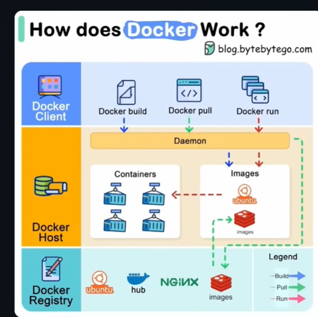

# Docker Temel Bilgiler

**İçindekiler**
- [Docker Temel Bilgiler](#docker-temel-bilgiler)
  - [Temel Felsefe ve Container Teknolojisi](#temel-felsefe-ve-container-teknolojisi)
    - [Büyük Analoji — Yük Gemisi](#büyük-analoji--yük-gemisi)
    - [VM vs Docker — Temel Farklar](#vm-vs-docker--temel-farklar)
      - [1) Sanal Makineler (Virtual Machines - VM)](#1-sanal-makineler-virtual-machines---vm)
      - [2) Docker Containerleri](#2-docker-containerleri)
  - [Neden ve Ne Zaman Docker Kullanılır?](#neden-ve-ne-zaman-docker-kullanılır)
    - [1. "Benim Makinemde Çalışıyordu" Sorunu (Dependency Hell)](#1-benim-makinemde-çalışıyordu-sorunu-dependency-hell)
    - [2. Yeni Ekip Arkadaşı ve Kurulum Çilesi (Onboarding)](#2-yeni-ekip-arkadaşı-ve-kurulum-çilesi-onboarding)
    - [3. İzolasyon ve "Kirletmeden" Deneme](#3-i̇zolasyon-ve-kirletmeden-deneme)
    - [4. Microservices Mimarisi](#4-microservices-mimarisi)
    - [Özet: Ne Zaman Kullanmalıyım?](#özet-ne-zaman-kullanmalıyım)
  - [Bilinmesi Gereken Terimler](#bilinmesi-gereken-terimler)
    - [1. Dockerfile (Reçete / Tarif)](#1-dockerfile-reçete--tarif)
    - [2. Image (Kalıp / Dondurulmuş Yemek)](#2-image-kalıp--dondurulmuş-yemek)
    - [3. Container (Canlı Ortam / Servis Edilen Yemek)](#3-container-canlı-ortam--servis-edilen-yemek)
    - [4. Docker Registry / Docker Hub (Menü / Market)](#4-docker-registry--docker-hub-menü--market)
    - [Özet Akış (Workflow)](#özet-akış-workflow)
  - [Uygulama Pratiği: Basit Bir Node.js Uygulaması](#uygulama-pratiği-basit-bir-nodejs-uygulaması)
    - [Adım 1: Uygulamayı Hazırlamak (Kod)](#adım-1-uygulamayı-hazırlamak-kod)
    - [Adım 2: Reçeteyi Yazmak (Dockerfile)](#adım-2-reçeteyi-yazmak-dockerfile)
    - [Adım 3: Build İşlemi (Image Oluşturma)](#adım-3-build-i̇şlemi-image-oluşturma)
    - [Adım 4: Run İşlemi (Container Başlatma)](#adım-4-run-i̇şlemi-container-başlatma)
    - [Adım 5: Test](#adım-5-test)
  - [Dockerfile Komutları](#dockerfile-komutları)
    - [1. FROM](#1-from)
    - [2. WORKDIR](#2-workdir)
    - [3. COPY](#3-copy)
    - [4. RUN](#4-run)
    - [5. ENV](#5-env)
    - [6. EXPOSE](#6-expose)
    - [7. CMD](#7-cmd)
    - [Özet: Bir .NET API için Akış Nasıl Olur?](#özet-bir-net-api-için-akış-nasıl-olur)

## Temel Felsefe ve Container Teknolojisi
Docker'ı anlamak için bilgisayar dünyasından çıkıp bir limana gittiğimizi hayal edelim.

### Büyük Analoji — Yük Gemisi
Docker kelimesi İngilizce'de "liman işçisi" anlamına gelir; logosundaki balina sırtında Containerler taşır. Bu, Docker felsefesini güzel özetler:

- **Docker öncesi (karma yükleme):** Eskiden gemilere farklı eşyalar (un, piyano, otomobil, mobilya vb.) karışık şekilde yüklenirdi. Eşyalar birbirine zarar verebilir, yükleme/indirme karmaşık olurdu.
- **Docker dünyası (standart Container):** Standart metal Containerler sayesinde içeriğin ne olduğu taşıyıcıyı ilgilendirmez; Containerin standart boyutu her gemiye ve tıra uyacak şekilde tasarlanmıştır.

Yukarıdaki örnekte olduğu gibi yük gemisini bir bilgisayar olarak düşünürsek, Docker uygulamalarınızı ve onların çalışması için gereken tüm bağımlılıkları bir "Container" içine paketler. Böylece uygulama; geliştirme, test ve üretim ortamlarında tutarlı şekilde çalışır: "Bir kere paketle, her yerde çalıştır." Buna ek olarak, Containerler birbirinden izole olduğundan, farklı uygulamalar veya versiyonlar aynı sunucuda güvenle çalışabilir.

### VM vs Docker — Temel Farklar
Docker'ı anlayabilmek için sanal makinelerle karşılaştırmak faydalıdır. İnsanlar bazen Docker'ı "hafif VM" zanneder; ancak mimarileri temelden farklıdır.

#### 1) Sanal Makineler (Virtual Machines - VM)
- VM'in kendi tam işletim sistemi vardır (Ubuntu, Windows, vb.).
- Ağır ve hantaldır: Her uygulama için ayrı bir işletim sistemi çalıştırılır.
- Kaynak israfı olur: Bellek ve CPU daha fazla kullanılır.
- Başlatılması yavaştır: İşletim sistemi boot süresi dakikalar alabilir.

#### 2) Docker Containerleri
- Bir apartmanda dairelerde yaşamak gibidir: Containerler host işletim sistemi çekirdeğini (kernel) paylaşır.
- Hafiftir: Kendilerine ait tam bir işletim sistemi taşımazlar; yalnızca uygulama ve gereken bağımlılıkları içerirler.
- Verimli ve hızlıdır: Kaynak kullanımı düşüktür ve saniyeler içinde çalışmaya başlarlar.

**Görsel Özet**

| Özellik | Sanal Makine (VM) | Docker Container |
|---|---|---|
| İşletim Sistemi | Her VM kendi tam işletim sistemine sahiptir | Host işletim sistemi çekirdeğini paylaşır |
| Boyut | GB seviyesinde | MB seviyesinde |
| Açılış hızı | Dakikalar (OS boot) | Saniyeler veya milisaniyeler |
| Performans | Arada sanallaştırma katmanı olduğundan daha az verimli olabilir | Native performansa çok yakın |

**Özet**

Docker, uygulamaları taşımak ve çalıştırmak için standart, taşınabilir ve verimli bir yöntem sunar. Sanal makinelerin sunduğu izolasyon bazı durumlar için gerekli olsa da, Containerler hafiflikleri, hızları ve tutarlılıkları sayesinde modern dağıtık uygulamalarda tercih edilir.


## Neden ve Ne Zaman Docker Kullanılır?

### 1. "Benim Makinemde Çalışıyordu" Sorunu (Dependency Hell)
Geleneksel yöntemde kodunuzu sunucuya (Production) attığınızda, sunucudaki ortam sizin bilgisayarınızdan farklı olabilir.

**Senaryo**: Siz projeyi geliştirirken Node.js v20 kullandınız, ama sunucuda Node.js v14 kurulu. Veya sizde yüklü olan bir kütüphane sunucuda eksik.

**Sonuç**: Uygulama patlar.

**Docker Çözümü**: Docker, uygulamanızı sadece kodunuzla değil, kodun çalışması için gereken ortamla (Node sürümü, kütüphaneler, ayarlar) birlikte paketler. Sizin makinenizde çalışan Container, sunucuda da %100 aynı şekilde çalışır. Sürpriz yoktur.

### 2. Yeni Ekip Arkadaşı ve Kurulum Çilesi (Onboarding)
Bir projeye yeni bir yazılımcı katıldığında "geliştirme ortamını kurması" bazen 2 gün sürebilir.

**Eski Yöntem**: "Önce SQL Server kur, sonra Redis'i indir, sonra .NET SDK'nın şu sürümünü bul..."

**Docker Yöntemi**: Yeni gelen kişiye sadece "Projeyi indir ve docker-compose up komutunu çalıştır" dersiniz.

**Sonuç**: 15 dakika içinde veritabanı, backend, frontend ve gereken tüm servisler ayağa kalkar. Kahvesini bitirmeden kod yazmaya başlayabilir.

### 3. İzolasyon ve "Kirletmeden" Deneme
Diyelim ki projeniz için farklı bir veritabanı teknolojisi (örneğin PostgreSQL) denemek istiyorsunuz.

**Sorun**: Bilgisayarınıza PostgreSQL kurmak, beğenmezseniz kaldırmak, arkada bıraktığı dosyaları temizlemek zahmetlidir. Bilgisayarınız zamanla "çöplüğe" döner.

**Docker Çözümü**: PostgreSQL'i bir Container olarak saniyeler içinde başlatırsınız. İşiniz bitince Containeri silersiniz. Bilgisayarınızda (Host makine) tek bir iz bile kalmaz. İşletim sisteminiz her zaman temiz kalır.

### 4. Microservices Mimarisi
Eğer monolitik (tek parça) bir yapıdan çıkıp mikroservislere geçiyorsanız, Docker kaçınılmazdır.

Neden? Bir servisiniz .NET ile, diğer servisiniz Python ile, bir diğeri Node.js ile yazılmış olabilir. Hepsinin aynı makinede çakışmadan çalışması Docker ile çocuk oyuncağıdır. Her biri kendi izole Containerinde mutlu mesut yaşar.

### Özet: Ne Zaman Kullanmalıyım?
* Takım halinde çalışıyorsanız: Herkesin aynı ortamda çalıştığından emin olmak için.
* Sürekli Dağıtım (CI/CD) yapıyorsanız: Test ve Canlı ortamlarının birebir aynı olması için.
* Karmaşık bağımlılıklarınız varsa: Kurulum kılavuzu yazmak yerine Dockerfile yazmak için.
* Kirletmeden denemek için: Yeni teknolojileri bilgisayarınıza kurmadan denemek için.

## Bilinmesi Gereken Terimler
Docker'ı anlamak için bilmeniz gereken temel kavramlar aşağıda açıklanmıştır. Her kavram, günlük hayattan örneklerle açıklanmıştır.

### 1. Dockerfile (Reçete / Tarif)
Her şey burada başlar. Bu, uzantısı olmayan basit bir metin dosyasıdır (Dockerfile).

**Nedir?**
Aşçıya (Docker'a) yemeği nasıl yapacağını adım adım anlatan reçetedir.

**Ne İçerir?**
- Taban olarak Ubuntu kullan.
- İçine Node.js yükle.
- Benim yazdığım app.js dosyasını içeri kopyala.
- 8080 portunu aç.

**Özelliği**
İnsanlar tarafından okunabilir ve yazılabilir.

### 2. Image (Kalıp / Dondurulmuş Yemek)
Reçetenin (Dockerfile) işlenmiş halidir.

**Nedir?**
`docker build` komutunu çalıştırdığınızda, Docker reçeteyi okur ve bir **Image** oluşturur. Bunu dondurulmuş, paketlenmiş bir hazır yemek gibi düşünebilirsiniz.

**Özelliği**
**Salt Okunurdur (Read-Only):** Image oluşturulduktan sonra değiştirilemez. Değiştirmek isterseniz reçeteyi güncelleyip yeniden "build" etmeniz gerekir.

**Katmanlı Yapı (Layers)**
Docker akıllıdır. Eğer reçetenizde sadece son satırı değiştirirseniz, tüm yemeği baştan yapmaz; sadece değişen katmanı günceller. Bu yüzden çok hızlıdır.

### 3. Container (Canlı Ortam / Servis Edilen Yemek)
Image'ın canlanmış, çalışan halidir.

**Nedir?**
`docker run` komutunu verdiğinizde, Docker o donmuş Image'ı alır, çözer ve çalıştırır. Artık sıcak, dumanı tüten, yenebilir bir yemek (çalışan bir uygulama) vardır.

**Özelliği**
Geçicidir. İstediğiniz kadar başlatıp durdurabilir, silebilirsiniz. Sildiğinizde Image (kalıp) hala durur, istediğiniz an tekrar yeni bir Container oluşturabilirsiniz.

**İlişki**
1 tane Image'dan, birbirinin aynısı 100 tane Container oluşturabilirsiniz. (Bir tariften 100 tabak yemek çıkarmak gibi).

### 4. Docker Registry / Docker Hub (Menü / Market)
Image'ların saklandığı depodur.

**Nedir?**
Başkalarının hazırladığı Image'ları bulabileceğiniz yerdir. Örneğin, PostgreSQL kurmak için oturup sıfırdan "Postgres nasıl kurulur?" diye reçete yazmanıza gerek yoktur.

**Docker Hub**
Dünyanın en büyük Image kütüphanesidir. `postgres`, `node`, `nginx` gibi resmi Image'ları buradan tek komutla çekebilirsiniz (`docker pull`).

### Özet Akış (Workflow)
Bir yazılımcı olarak günlük döngünüz şöyle olacaktır:

1. **Kodla:** Uygulamanı yaz.
2. **Dockerfile Hazırla:** "Bu uygulamanın çalışması için ne lazım?" sorusunun cevabını yaz.
3. **Build (İnşa Et):** `docker build` komutu ile Dockerfile'dan bir Image oluştur.
4. **Run (Çalıştır):** `docker run` komutu ile Image'dan bir Container ayağa kaldır.



Docker'ın çalışma mantığını anlamak için aşağıdaki görsel ve açıklamaları inceleyin. Görsel, Docker'ın istemci-sunucu mimarisini gösterir.

1. Mavi Alan: Docker Client (Komuta Merkezi)
Burası sizin olduğunuz yerdir. Yani terminaliniz veya komut satırınız. Görevi
Siz buraya komutları (`docker build`, `docker pull`, `docker run`) yazarsınız. Dikkat ederseniz oklar buradan aşağıya, "Daemon"a gidiyor. Yani siz işi yapmazsınız, siz sadece "emri verirsiniz". Docker Client, bu emri alır ve alttaki sarı alana (Host) iletir.
2. Sarı Alan: Docker Host (Mutfak / İşlem Merkezi)
Burası, Docker'ın yüklü olduğu bilgisayardır (Sizin bilgisayarınız veya uzak bir sunucu). Daemon (Ortadaki Turuncu Çubuk)
Görselin en kritik parçasıdır. O, mutfağın baş aşçısıdır. Arka planda sessizce çalışır, Client'tan gelen emirleri dinler ve uygular. Images (Sağdaki Kutu)
Daemon'ın oluşturduğu veya indirdiği kalıplar burada durur (Ubuntu, Redis logolarını görüyorsunuz). Burası kilerinizdir. Containers (Soldaki Kutu)
Kırmızı kesikli oka dikkat edin: Images kutusundan Containers kutusuna gidiyor. Bu, bir Image'ın çalıştırılarak "Canlı Container" haline gelmesini temsil eder. Ocağın üzerindeki tencereler buradadır. Uygulamanız burada çalışır.
3. Turkuaz Alan: Docker Registry (Market / Toptancı)
Burası internetteki uzak depodur (Genellikle Docker Hub). Görevi
Bilgisayarınızda (Host) olmayan bir Image'a ihtiyacınız olduğunda (örneğin Nginx veya Redis), Daemon buraya bağlanır. İşleyiş
Yeşil kesikli oklara dikkat: Bu oklar, Registry'den (Marketten) alınıp Host'taki (Mutfağınızdaki) Image alanına indirilen dosyaları gösterir. Buna `docker pull` işlemi denir.

Şemadaki renkli okları takip edelim:
- Mavi Yol (Build)
  - `docker build` komutunu verirsiniz.
  - Daemon, sizin yazdığınız Dockerfile'ı alır ve ondan bir Image oluşturup "Images" kutusuna koyar.
- Yeşil Yol (Pull)
  - `docker pull` komutunu verirsiniz.
  - Daemon, Registry'den istediğiniz Image'ı indirir ve "Images" kutusuna koyar.
- Kırmızı Yol (Run)
  - `docker run` komutunu verirsiniz.
  - Daemon, "Images" kutusundan bir Image alır, çalıştırır ve "Containers" kutusuna koyar.

Bu görsel, Docker'ın **İstemci-Sunucu** (Client-Server) mimarisini gösterir. Siz emredersiniz (Client), Daemon yapar (Host), eksik varsa internetten getirir (Registry).

## Uygulama Pratiği: Basit Bir Node.js Uygulaması
Senaryomuz: Ekrana basit bir mesaj basan ve 3000 portunda çalışan mini bir web sunucumuz var. Amacımız bunu Docker içinde çalıştırmak.

### Adım 1: Uygulamayı Hazırlamak (Kod)
Bilgisayarınızda bir klasör açtığınızı ve içine `app.js` adında bir dosya oluşturduğunuzu varsayalım.

`app.js` içeriği:

```javascript
console.log("Docker içinden merhaba!");
// Basit bir HTTP sunucusu
const http = require('http');
const server = http.createServer((req, res) => {
  res.statusCode = 200;
  res.setHeader('Content-Type', 'text/plain');
  res.end('Merhaba! Bu mesaj bir Containerden geliyor.\n');
});

server.listen(3000, () => {
  console.log('Sunucu 3000 portunda çalışıyor...');
});
```

### Adım 2: Reçeteyi Yazmak (Dockerfile)
Aynı klasörde, uzantısı olmayan `Dockerfile` adında bir dosya oluşturuyoruz. Docker'a talimatları burada vereceğiz.

`Dockerfile` içeriği ve Anlamları:

```dockerfile
# 1. TABAN (Base Image): Hangi işletim sistemi/ortam üzerine kuracağız?
# Node.js yüklü, hafif bir Linux (Alpine) sürümü seçiyoruz.
FROM node:20-alpine

# 2. ÇALIŞMA ALANI: Containerin içinde hangi klasörde çalışacağız?
# Container içinde /app diye bir klasör oluşturur ve oraya gider.
WORKDIR /app

# 3. KOPYALAMA: Dosyalarımızı içeri atalım.
# İlk nokta: Bizim bilgisayarımızdaki mevcut klasör.
# İkinci nokta: Containerdeki çalışma alanı (/app).
COPY . .

# 4. KOMUT: Container ayağa kalktığında ne yapsın?
CMD ["node", "app.js"]
```

### Adım 3: Build İşlemi (Image Oluşturma)
Reçeteyi (Dockerfile) yazdık. Şimdi bunu pişirip dondurulmuş bir Image haline getirmeliyiz.

Terminali o klasörde açıp şu komutu yazıyoruz:

```bash
docker build -t ilk-uygulamam .
```

- `-t ilk-uygulamam`: Image'a bir etiket (isim) veriyoruz. (Tag)
- `.` (Nokta): "Dockerfile bu klasörde, buraya bak" diyoruz.

**Sonuç:** Docker, Node.js'i indirdi, dosyalarınızı kopyaladı ve `ilk-uygulamam` adında bir Image oluşturdu.

### Adım 4: Run İşlemi (Container Başlatma)
Artık elimizde bir Image var. Şimdi onu canlandıralım.

```bash
docker run -p 3000:3000 ilk-uygulamam
```

Buradaki `-p 3000:3000` (Port Mapping) kısmı çok kritiktir:

- Docker Containerleri dış dünyadan izole çalışır (kapalı kutu).
- Containerin içindeki 3000 portunu, sizin bilgisayarınızın (localhost) 3000 portuna bağlamazsanız, tarayıcıdan uygulamaya ulaşamazsınız.

**Mantık:** `localhost:3000` -> (Tünel) -> `Container:3000`

### Adım 5: Test
Tarayıcınızı açıp `http://localhost:3000` adresine gittiğinizde **"Merhaba! Bu mesaj bir Containerden geliyor."** yazısını göreceksiniz.

Az önce bilgisayarınıza Node.js kurmadan (veya kurulu olanı kullanmadan), izole bir ortamda Node.js uygulaması çalıştırdınız.

**Şu an neyiniz var?** Bu Image'ı alıp (Docker Hub'a yükleyip), dünyanın herhangi bir yerindeki, içinde Docker olan herhangi bir sunucuya atarsanız, tek bir satır kod değiştirmeden tıpkı sizin makinenizde çalıştığı gibi çalışacaktır.

## Dockerfile Komutları
Bir Dockerfile yazarken onlarca komut olsa da, gerçek hayatta (özellikle kurumsal projelerde) %90 oranında sadece aşağıdaki 7 temel komutu kullanırsınız.

### 1. FROM
Her Dockerfile bu komutla başlamak zorundadır. İşletim Sistemi + Çatıyı seçer.

Örneğin: 
| Teknoloji | Örnek Kullanım | Açıklama |
|-----------|----------------|----------|
| .NET | `FROM mcr.microsoft.com/dotnet/sdk:8.0` | Uygulamayı derlemek (build) için içinde tüm araçların (SDK) olduğu imaj. |
| React | `FROM node:20-alpine` | "Alpine" ifadesi çok önemlidir; gereksiz araçlardan arındırılmış, çok küçük (5-10MB) bir Linux sürümüdür. |

### 2. WORKDIR
Container içindeki "şu anki klasörü" (Current Directory) belirler. Linux'taki `cd` komutunun karşılığıdır. Dosyaların rastgele yerlere (/ kök dizinine) dağılmasını engellemek ve düzenli çalışmak için kullanılır.

Örneğin:
| Teknoloji | Örnek Kullanım | Açıklama |
|-----------|----------------|----------|
| Genel | `WORKDIR /app` | Bundan sonra yazacağın her komut, Container içindeki /app klasöründe çalıştırılsın. |

### 3. COPY
Sizin bilgisayarınızdaki (Host) dosyaları, Container içine kopyalar. Kodlarınızı image'ın içine atmak için kullanılır.

Önemli Taktik
Genellikle iki aşamada yapılır (Önce paket dosyaları, sonra kodlar). Bu, Docker'ın önbellekleme (caching) yapabilmesi içindir.

| Teknoloji | Örnek Kullanım | Açıklama |
|-----------|----------------|----------|
| .NET | `COPY *.csproj .` | Önce sadece proje dosyasını kopyala (Bağımlılıkları yüklemek için). |
| React | `COPY package*.json .` | Önce sadece package.json'ı kopyala (npm install için). |
| Genel | `COPY . .` | Geri kalan her şeyi içeri at. |

### 4. RUN
Image hazırlanırken (Build aşamasında) çalıştırılacak komutlardır. Bağımlılıkları yüklemek, uygulamayı derlemek, dosya izinlerini ayarlamak için kullanılır.

Kritik Fark
Bu komut container çalışırken **DEĞİL**, image oluşturulurken çalışır.

| Teknoloji | Örnek Kullanım | Açıklama |
|-----------|----------------|----------|
| .NET | `RUN dotnet restore` | NuGet paketlerini indirir. |
| .NET | `RUN dotnet publish -c Release -o out` | Uygulamayı yayınlanabilir (DLL) hale getirir. |
| React | `RUN npm install` | Node modüllerini indirir. |
| React | `RUN npm run build` | React kodunu tarayıcının anlayacağı HTML/JS/CSS'e dönüştürür. |

### 5. ENV
Container içine Ortam Değişkeni (Environment Variable) tanımlar.

Örneğin:
| Teknoloji | Örnek Kullanım | Açıklama |
|-----------|----------------|----------|
| .NET | `ENV ASPNETCORE_URLS=http://+:8080` | Uygulamanın 8080 portunu dinlemesini sağlar. |
| .NET | `ENV ASPNETCORE_ENVIRONMENT=Production` | Uygulamayı Canlı (Prod) moduna alır (Hata detaylarını gizler vb.). |

### 6. EXPOSE
Containerin hangi porttan yayın yapacağını belgeler. Bu aslında teknik bir zorunluluktan çok, Dockerfile'ı okuyan diğer geliştiricilere (veya Docker'a) "Hey, bu uygulama 80 portunu kullanıyor" bilgisini vermek içindir.

Örneğin:
| Teknoloji | Örnek Kullanım | Açıklama |
|-----------|----------------|----------|
| Genel | `EXPOSE 8080` | Bu Container 8080 portundan trafiği kabul eder. |

### 7. CMD
Container ayağa kalktığında (Run aşamasında) çalışacak varsayılan komuttur. Uygulamayı başlatan "Start" tuşudur. Bir Dockerfile'da sadece bir tane CMD olabilir.

Örneğin:
| Teknoloji | Örnek Kullanım | Açıklama |
|-----------|----------------|----------|
| .NET | `CMD ["dotnet", "MyApi.dll"]` | Derlenmiş .NET uygulamasını başlatır. |
| React (Dev) | `CMD ["npm", "start"]` | Geliştirme sunucusunu başlatır. |
| React (Prod) | `CMD ["nginx", "-g", "daemon off;"]` | React build dosyalarını sunmak için Nginx sunucusunu başlatır. |

### Özet: Bir .NET API için Akış Nasıl Olur?

Tüm bu komutlar bir araya geldiğinde mantıksal akış şöyledir:

1. **FROM:** .NET SDK'yı getir.
2. **WORKDIR:** /app klasörüne gir.
3. **COPY:** .csproj dosyasını at.
4. **RUN:** `dotnet restore` (Paketleri yükle).
5. **COPY:** Kalan tüm kodları at.
6. **RUN:** `dotnet publish` (Uygulamayı derle).
7. **ENV:** Ortam ayarlarını yap.
8. **CMD:** Uygulamayı çalıştır (`dotnet run`).